# Data Model (AI)

## 1. Database Diagram

```mermaid
erDiagram
    auth_user {
        int id PK
        varchar username
        varchar password
        varchar email
        varchar first_name
        varchar last_name
        bool is_staff
        bool is_active
        bool is_superuser
        datetime date_joined
    }

    NssUser {
        int id PK
        int user_id FK
        varchar slack_handle
        varchar github_handle
    }

    Cohort {
        int id PK
        varchar name
        varchar slack_channel
        date start_date
        date end_date
        date break_start_date
        date break_end_date
        bool active
    }

    CohortInfo {
        int id PK
        int cohort_id FK
        varchar student_organization_url
        varchar github_classroom_url
        varchar attendance_sheet_url
        varchar client_course_url
        varchar server_course_url
        varchar zoom_url
    }

    NssUserCohort {
        int id PK
        int nss_user_id FK
        int cohort_id FK
        bool is_github_org_member
    }

    CohortEvent {
        int id PK
        int cohort_id FK
        varchar event_name
        int event_type_id FK
        datetime event_datetime
        text description
        datetime created_at
        datetime updated_at
    }

    CohortEventType {
        int id PK
        varchar description
        varchar color
    }

    Course {
        int id PK
        varchar name
        date date_created
        bool active
    }

    CohortCourse {
        int id PK
        int cohort_id FK
        int course_id FK
        bool active
        smallint index
    }

    Book {
        int id PK
        varchar name
        int course_id FK
        text description
        int index
    }

    Project {
        int id PK
        varchar name
        varchar implementation_url
        url client_template_url
        url api_template_url
        int book_id FK
        int index
        bool active
        bool is_group_project
    }

    StudentProject {
        int id PK
        int student_id FK
        int project_id FK
        date date_created
    }

    ProjectNote {
        int id PK
        int user_id FK
        int project_id FK
        text note
    }

    ProjectTag {
        int id PK
        int project_id FK
        int tag_id FK
    }

    Capstone {
        int id PK
        int student_id FK
        int course_id FK
        varchar proposal_url
        varchar repo_url
        text description
    }

    CapstoneTimeline {
        int id PK
        int capstone_id FK
        int status_id FK
        datetime date
    }

    ProposalStatus {
        int id PK
        varchar status
    }

    Assessment {
        int id PK
        varchar name
        varchar source_url
        int book_id FK
        varchar type
    }

    AssessmentObjective {
        int id PK
        int assessment_id FK
        int objective_id FK
    }

    AssessmentWeight {
        int id PK
        int weight_id FK
        int assessment_id FK
    }

    StudentAssessment {
        int id PK
        int student_id FK
        int assessment_id FK
        int status_id FK
        int instructor_id FK
        varchar url
        date date_created
    }

    StudentAssessmentStatus {
        int id PK
        varchar status
    }

    StudentNote {
        int id PK
        int student_id FK
        int coach_id FK
        int note_type_id FK
        text note
        datetime created_on
    }

    StudentNoteType {
        int id PK
        varchar label
    }

    StudentTag {
        int id PK
        int student_id FK
        int tag_id FK
    }

    StudentTeam {
        int id PK
        varchar group_name
        int cohort_id FK
        bool sprint_team
        varchar slack_channel
    }

    NSSUserTeam {
        int id PK
        int team_id FK
        int student_id FK
    }

    StudentMentor {
        int id PK
        int student_id FK
        int mentor_id FK
        int capstone_id FK
    }

    StudentPersonality {
        int id PK
        int student_id FK
        varchar briggs_myers_type
        int bfi_extraversion
        int bfi_agreeableness
        int bfi_conscientiousness
        int bfi_neuroticism
        int bfi_openness
    }

    OneOnOneNote {
        int id PK
        int student_id FK
        int coach_id FK
        text notes
        datetime session_date
    }

    Opportunity {
        int id PK
        int senior_instructor_id FK
        int cohort_id FK
        varchar portion
        date start_date
        text message
    }

    OpportunityUser {
        int id PK
        int student_id FK
        int opportunity_id FK
        date date_created
    }

    CohortGithubProject {
        int id PK
        int cohort_id FK
        varchar project_name
        bool assessment
        varchar project_url
    }

    GroupProjectRepository {
        int id PK
        int team_id FK
        int project_id FK
        varchar repository
    }

    Tag {
        int id PK
        varchar name
    }

    LightningExercise {
        int id PK
        varchar name
        text description
    }

    LightningTag {
        int id PK
        int exercise_id FK
        int tag_id FK
    }

    TaxonomyLevel {
        int id PK
        varchar level_name
    }

    LearningObjective {
        int id PK
        varchar swbat
        int bloom_level_id FK
    }

    ObjectiveTag {
        int id PK
        int objective_id FK
        int tag_id FK
    }

    FoundationsExercise {
        int id PK
        varchar learner_github_id
        varchar learner_name
        varchar title
        varchar slug
        int attempts
        bool complete
        datetime completed_on
        datetime first_attempt
        datetime last_attempt
        text completed_code
        bool used_solution
    }

    FoundationsLearnerProfile {
        int id PK
        varchar learner_github_id
        varchar learner_name
        varchar cohort_type
        int cohort_number
    }

    CoreSkill {
        int id PK
        varchar label
    }

    CoreSkillRecord {
        int id PK
        int student_id FK
        int skill_id FK
        int level
        date created_on
    }

    CoreSkillRecordEntry {
        int id PK
        int record_id FK
        text note
        date recorded_on
        int instructor_id FK
    }

    LearningWeight {
        int id PK
        varchar label
        int weight
        int tier
    }

    LearningRecord {
        int id PK
        int student_id FK
        int weight_id FK
        bool achieved
        date created_on
    }

    LearningRecordEntry {
        int id PK
        int record_id FK
        text note
        date recorded_on
        int instructor_id FK
    }

    auth_user ||--|| NssUser : "user"
    NssUser ||--o{ NssUserCohort : "assigned_cohorts"
    Cohort ||--o{ NssUserCohort : "members"
    Cohort ||--|| CohortInfo : "info"
    Cohort ||--o{ CohortCourse : "courses"
    Course ||--o{ CohortCourse : "cohorts"
    Cohort ||--o{ CohortEvent : "events"
    CohortEventType ||--o{ CohortEvent : "event_type"
    Course ||--o{ Book : "books"
    Book ||--o{ Project : "child_projects"
    Book ||--o{ Assessment : "assessments"
    Project ||--o{ StudentProject : "students"
    NssUser ||--o{ StudentProject : "projects"
    Project ||--o{ ProjectNote : "project"
    NssUser ||--o{ ProjectNote : "user"
    Project ||--o{ ProjectTag : "projecttags"
    Tag ||--o{ ProjectTag : "projecttags"
    NssUser ||--o{ Capstone : "capstones"
    Course ||--o{ Capstone : "course"
    Capstone ||--o{ CapstoneTimeline : "statuses"
    ProposalStatus ||--o{ CapstoneTimeline : "status"
    Assessment ||--o{ AssessmentObjective : "assessment"
    LearningObjective ||--o{ AssessmentObjective : "objective"
    Assessment ||--o{ AssessmentWeight : "weight_assignments"
    LearningWeight ||--o{ AssessmentWeight : "assessment_assignments"
    NssUser ||--o{ StudentAssessment : "assessments"
    Assessment ||--o{ StudentAssessment : "students"
    StudentAssessmentStatus ||--o{ StudentAssessment : "status"
    NssUser ||--o{ StudentAssessment : "assignments"
    NssUser ||--o{ StudentNote : "notes"
    NssUser ||--o{ StudentNote : "coach"
    StudentNoteType ||--o{ StudentNote : "note_type"
    NssUser ||--o{ StudentTag : "tags"
    Tag ||--o{ StudentTag : "students"
    Cohort ||--o{ StudentTeam : "cohort"
    StudentTeam ||--o{ NSSUserTeam : "team"
    NssUser ||--o{ NSSUserTeam : "student"
    NssUser ||--o{ StudentMentor : "mentors"
    NssUser ||--o{ StudentMentor : "students"
    Capstone ||--o{ StudentMentor : "capstone"
    NssUser ||--|| StudentPersonality : "personality"
    NssUser ||--o{ OneOnOneNote : "feedback"
    NssUser ||--o{ OneOnOneNote : "coach_notes"
    NssUser ||--o{ Opportunity : "coaching_opportunities"
    Cohort ||--o{ Opportunity : "ta_opportunities"
    NssUser ||--o{ OpportunityUser : "student"
    Opportunity ||--o{ OpportunityUser : "ta_opportunities"
    Cohort ||--o{ CohortGithubProject : "cohort"
    StudentTeam ||--o{ GroupProjectRepository : "repositories"
    Project ||--o{ GroupProjectRepository : "project"
    TaxonomyLevel ||--o{ LearningObjective : "objectives"
    LearningObjective ||--o{ ObjectiveTag : "objectivetags"
    Tag ||--o{ ObjectiveTag : "objectivetags"
    LightningExercise ||--o{ LightningTag : "lightningtags"
    Tag ||--o{ LightningTag : "lightningtags"
    NssUser ||--o{ CoreSkillRecord : "core_skills"
    CoreSkill ||--o{ CoreSkillRecord : "skill"
    CoreSkillRecord ||--o{ CoreSkillRecordEntry : "notes"
    NssUser ||--o{ CoreSkillRecordEntry : "student_skills"
    NssUser ||--o{ LearningRecord : "learning_records"
    LearningWeight ||--o{ LearningRecord : "records"
    LearningRecord ||--o{ LearningRecordEntry : "entries"
    NssUser ||--o{ LearningRecordEntry : "student_records"
```



**Relationship highlights:**
- `NssUser` is the most connected table — it links to nearly every other table as either a student, coach, or instructor
- Several through-tables handle many-to-many relationships: `NssUserCohort`, `NSSUserTeam`, `AssessmentWeight`, `CohortCourse`, `StudentProject`
- `NssUser` appears twice in `StudentAssessment` (as both `student` and `instructor`) and twice in `StudentNote` (as both `student` and `coach`)

## 2. Database Info

**Database type:** PostgreSQL

**Engine string:** `django.db.backends.postgresql_psycopg2`

**Defined in:** `learn-ops-api/LearningPlatform/settings.py`, line 197, inside the `DATABASES` dictionary

**Notes:**
- `django.db.backends` — Django's built-in database backend system; the layer Django uses to translate Python ORM calls into SQL
- `postgresql_psycopg2` — names both the database (PostgreSQL) and the Python driver (`psycopg2`) that handles the connection
- The `DATABASES` block reads connection credentials (`NAME`, `USER`, `PASSWORD`, `HOST`, `PORT`) from environment variables via `os.getenv()`, which is why those values live in the `.env` file rather than directly in settings

**ORM:** Django ORM (built into Django — no separate library needed)

**How it works:** Every model class inherits from `models.Model` (imported from `django.db`). Django reads those class definitions and handles creating and querying the database tables automatically. You never write raw SQL for standard operations.

**pgAdmin connection details:**

| Field         | Value              | Source file                          |
|---------------|--------------------|--------------------------------------|
| Host          | `localhost`        | `learn-ops-infrastructure/docker-compose.yml` (ports: `5432:5432` maps container to host) |
| Port          | `5432`             | `learn-ops-api/.env` (`LEARN_OPS_PORT=5432`) |
| Database name | `learningplatform` | `learn-ops-api/.env` (`LEARN_OPS_DB=learningplatform`) |
| Username      | `learnops`         | `learn-ops-api/.env` (`LEARN_OPS_USER=learnops`) |
| Password      | `learnops123`      | `learn-ops-api/.env` (`LEARN_OPS_PASSWORD=learnops123`) |

> **Note on Host:** Inside the Docker network, the API connects to the database using the hostname `database` (also from `.env`: `LEARN_OPS_HOST=database`). But pgAdmin runs on your local machine *outside* Docker, so you connect via `localhost` — the `docker-compose.yml` port mapping makes that work.

## 3. Model to Table Mapping

**Example model:** `NssUser` — defined in `LearningAPI/models/people/nssuser.py`

| Model Name | Table Name |
|------------|------------|
| `NssUser` | `learningapi_nssuser` |

> Django automatically generates the table name as `appname_modelname` (all lowercase). The app here is `LearningAPI`.

| Property Name | Column Name | Data Type | Notes |
|---------------|-------------|-----------|-------|
| *(auto)* | `id` | `integer` | Primary key — added automatically by Django because `DEFAULT_AUTO_FIELD = AutoField` in settings |
| `user` | `user_id` | `integer` | Foreign key to Django's built-in `auth_user` table. Django appends `_id` to all relationship fields |
| `slack_handle` | `slack_handle` | `varchar(55)` | Nullable (`null=True`) |
| `github_handle` | `github_handle` | `varchar(55)` | Nullable (`null=True`) |

**Naming conventions:**
- **Table names** — Django combines the app name and model name: `learningapi` + `nssuser` = `learningapi_nssuser`
- **Foreign key columns** — Django appends `_id` to the property name, so `user` in Python becomes `user_id` in the database

**How the ORM writes to the database — `book.save()`**

Found in: `LearningAPI/views/book_view.py`, line 30

```python
book = Book()                              # creates a Book object in Python memory only — nothing in the DB yet
book.description = request.data["description"]
book.name = request.data["name"]
book.index = request.data["index"]
book.course = course                       # assigns the related Course object

book.save()                                # THIS is where the database is touched
```

When `book.save()` is called, the Django ORM translates it into a SQL `INSERT` statement and sends it to PostgreSQL:

```sql
INSERT INTO learningapi_book (description, name, index, course_id)
VALUES ('...', '...', 1, 4);
```

PostgreSQL writes the new row to the `learningapi_book` table and returns the auto-generated `id`. Django then sets `book.id` on the Python object, which is why the serializer on the next line can include the new book's `id` in the response.

**Key idea:** Before `.save()`, the book exists only in Python. After `.save()`, it exists in the database.

## 4. Relationship Examples

**One-to-one** (field name: `user`)
- File: `LearningAPI/models/people/nssuser.py`, line 12
- `user = models.OneToOneField(settings.AUTH_USER_MODEL, on_delete=models.CASCADE)`
- Each `NssUser` has exactly one Django `auth_user`, and each `auth_user` has at most one `NssUser`
- Django enforces this with a unique constraint on the FK column

**One-to-many** (field name: `course`)
- File: `LearningAPI/models/coursework/book.py`, line 6
- `course = models.ForeignKey("Course", on_delete=models.CASCADE, related_name="books")`
- One `Course` can have many `Book`s, but each `Book` belongs to exactly one `Course`
- This is the most common relationship type in the codebase — a plain `ForeignKey`

**Many-to-many** (field name: `objectives`)
- File: `LearningAPI/models/people/assessment.py`, line 16
- `objectives = models.ManyToManyField("LearningWeight", through='AssessmentWeight')`
- An assessment can test many learning objectives, and a learning objective can appear on many assessments
- The `through='AssessmentWeight'` means Django uses an explicit join table (`AssessmentWeight`) rather than creating one automatically — this is common when you want to add extra data to the relationship itself
