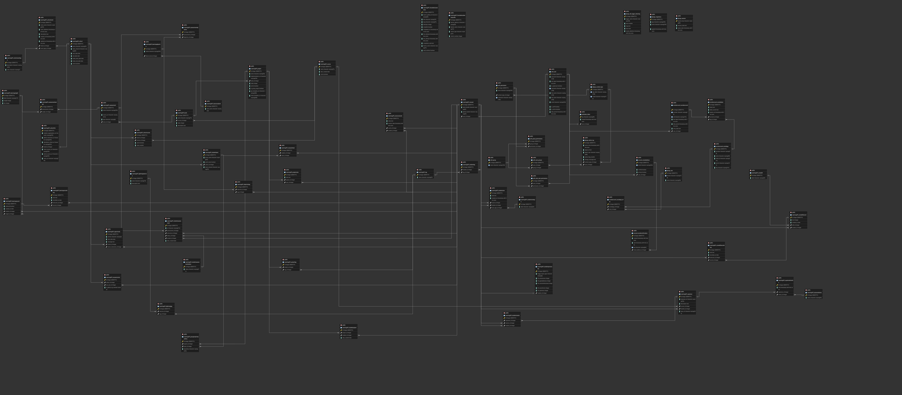

# Data Model

## 1. Database Diagram

## 2. Database Info

**Database type:**
postgres:16

**ORM:**
assessment.py

## 3. Model to Table Mapping

| Model Name | Table Name |
|------------|------------|
| Model 1 (assessment_objective.py)    |   AssessmentObjective   |
| Model 2  (assessment.py)  |    Assessment        |

| Property Name | Column Name | Data Type |
|---------------|-------------|-----------|
|   LearningAPI_assessment            |   id          |   integer        |
|   LearningAPI_assessment             |     name        |     varchar(255)      |
|   LearningAPI_assessment          |       source_url      |      varchar(512)     |
|   LearningAPI_assessment            |     type        |      varchar(8)     |
|   LearningAPI_assessment           |       book_id      |   integer        |

## 4. Relationship Examples

**One-to-one** (field name: )

| Model Name | Table Name | PK Column | FK Column |
|------------|------------|-----------|-----------|
| assessment_objective.py   |  AssessmentObjective          |   id        |     book      |
| assessment.py   |  Assessment          |    id       |     assessment & objective      |

**One-to-many** (field name: )

| Model Name | Table Name | PK Column | FK Column |
|------------|------------|-----------|-----------|
| Model 1    |            |           |           |
| Model 2    |            |           |           |

**Many-to-many** (field name: )

| Model Name | Table Name | PK Column | FK Column |
|------------|------------|-----------|-----------|
| Model 1    |            |           |           |
| Model 2    |            |           |           |
| (junction) |            |           |           |