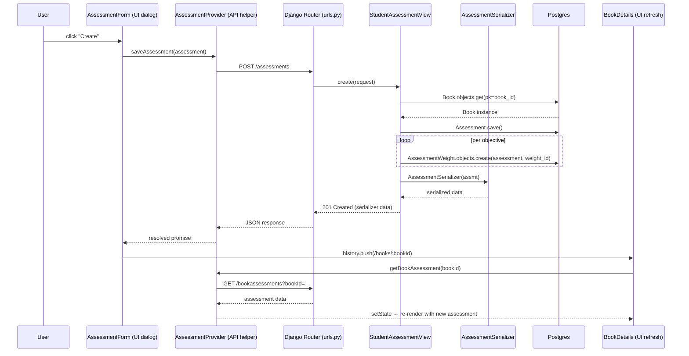

# Trace Notes (AI): assessments (learn-ops-api)

### Request path table from Claude

| Layer | File | Class / Function | What it does |
|-------|------|-----------------|--------------|
| UI dialog | `learn-ops-client/src/components/assessments/AssessmentForm.js` | `AssessmentForm` → `create(evt)` | Instructor fills out book, name, source URL, and learning objectives, then clicks "Create"; calls `saveAssessment(...)` |
| API helper | `learn-ops-client/src/components/assessments/AssessmentProvider.js` | `saveAssessment(assessment)` | `fetchIt(POST /assessments, body: {name, sourceURL, bookId, objectives})` |
| URL router | `learn-ops-api/LearningPlatform/urls.py` | `router.register(r'assessments', views.StudentAssessmentView, 'assessment')` | DRF `DefaultRouter` maps `POST /assessments` to `StudentAssessmentView.create` |
| View | `learn-ops-api/LearningAPI/views/student_assessment.py` | `StudentAssessmentView.create(request)` | Since `name`, `sourceURL`, `objectives`, `bookId` are present and the requester is staff, builds a new `Assessment` (the staff/admin branch of `create`, as opposed to the student self-assignment branch) |
| Serializer | `learn-ops-api/LearningAPI/views/student_assessment.py` | `AssessmentSerializer` (+ nested `AssessmentObjectiveSerializer`) | Serializes the saved `Assessment` (`id`, `name`, `objectives`) back to JSON |
| DB | `learn-ops-api/LearningAPI/models/people/assessment.py`, `.../models/coursework.py`, `.../models/skill/assessment_weight.py` | `Book.objects.get(pk=book_id)`, `Assessment.save()`, `AssessmentWeight.objects.create(assessment=assmt, weight_id=objective)` (looped per objective) | Looks up the target `Book`, persists the new `Assessment` row, then writes one `AssessmentWeight` join row per selected learning objective |
| UI refresh | `learn-ops-client/src/components/course/BookDetails.js` | `history.push('/books/:bookId')` (from `AssessmentForm`) → `BookDetails` `useEffect` → `getBookAssessment(bookId)` | After save resolves, the form navigates back to the book page, whose effect re-fetches `GET /bookassessments?bookId=` and re-renders with the new assessment shown |

**Note:** `StudentAssessmentView.create` has a second branch (`else`) used when the caller is a student/non-staff, which instead creates a `StudentAssessment` (self-assignment of an existing assessment) via `StudentAssessmentSerializer`. The client-side counterpart for that branch, `saveStudentAssessment(assessmentId, studentId)` in `AssessmentProvider.js`, is only ever destructured in `learn-ops-client/src/components/people/StudentTabList.js` (`chosenAssessment`/`assign`) but is never wired to a rendered control in that file's JSX — so that path currently has no live UI trigger.

### Sequence Diagram

