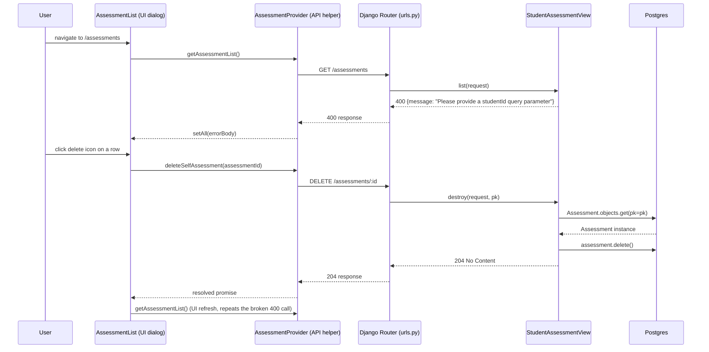

# Trace Notes (AI): assessments (learn-ops-client)

### Request path table from Claude

| Layer | File | Class / Function | What it does |
|-------|------|-----------------|--------------|
| UI dialog | `learn-ops-client/src/components/assessments/AssessmentList.js` | `AssessmentList` → `useEffect` on mount; delete icon `onClick` | Page rendered at route `/assessments`; on mount calls `getAssessmentList()`, and each row's delete icon calls `deleteSelfAssessment(assessment.id)` |
| API helper | `learn-ops-client/src/components/assessments/AssessmentProvider.js` | `getAssessmentList()` / `deleteSelfAssessment(assessmentId)` | `getAssessmentList`: `fetch(GET /assessments)` with **no query params**, `.then(setAll)`. `deleteSelfAssessment`: `fetchIt(DELETE /assessments/:id)` |
| URL router | `learn-ops-api/LearningPlatform/urls.py` | `router.register(r'assessments', views.StudentAssessmentView, 'assessment')` | DRF `DefaultRouter` maps `GET /assessments` → `StudentAssessmentView.list`, `DELETE /assessments/:id` → `StudentAssessmentView.destroy` |
| View | `learn-ops-api/LearningAPI/views/student_assessment.py` | `StudentAssessmentView.list(request)` / `.destroy(request, pk)` | `list()` requires a `studentId` query param — since `AssessmentList.js` never sends one, it short-circuits to `400 {"message": "Please provide a studentId query parameter"}` before any serialization happens. `destroy()` looks up an `Assessment` by pk and deletes it |
| Serializer | `learn-ops-api/LearningAPI/views/student_assessment.py` | `StudentAssessmentSerializer` (only reached if `studentId` is present) | Never actually invoked for this call, since the 400 short-circuit happens first |
| DB | `learn-ops-api/LearningAPI/models/people/assessment.py` | `Assessment.objects.get(pk=pk)` then `assessment.delete()` (in `destroy`) | Only the delete path touches the DB here — the list path never reaches a query because of the missing `studentId` |
| UI refresh | `learn-ops-client/src/components/assessments/AssessmentList.js` | `deleteSelfAssessment(...).then(getAssessmentList)` | After a successful delete, re-runs the same `GET /assessments` call — which is the broken call described above |

**Bug found while tracing:** `AssessmentList.js` renders fields like `assessment.source_url`, `assessment.assigned_book.name`, `assessment.course.name`, and `assessment.objectives` — but `GET /assessments` (no `studentId`) never returns that shape; it 400s. The endpoint that *does* return exactly that shape is `BookAssessmentView` at `/bookassessments` (`learn-ops-api/LearningAPI/views/book_assessment.py:110`, its own `AssessmentSerializer` with `fields = ('id', 'name', 'source_url', 'assigned_book', 'course', 'objectives')`) — which is what `AssessmentForm.js`'s `getAssessment`/`getBookAssessment` correctly call. `AssessmentList.js` appears to be calling the wrong provider function (`getAssessmentList` → `/assessments` instead of something hitting `/bookassessments`), so in its current state this page cannot successfully load or render any assessments.

### Sequence Diagram

